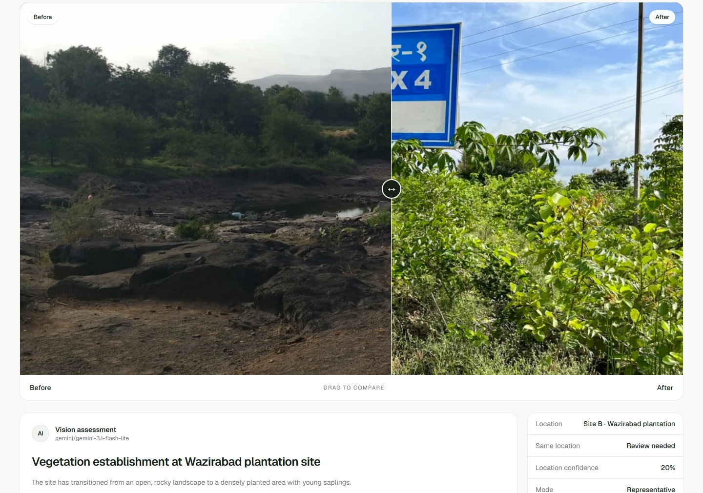
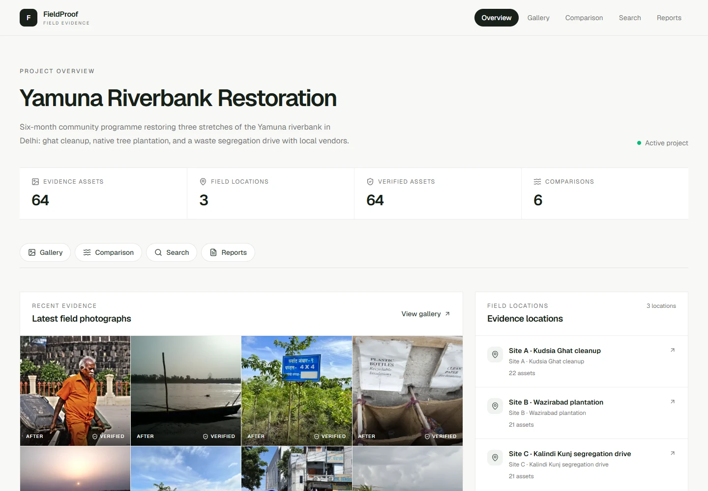
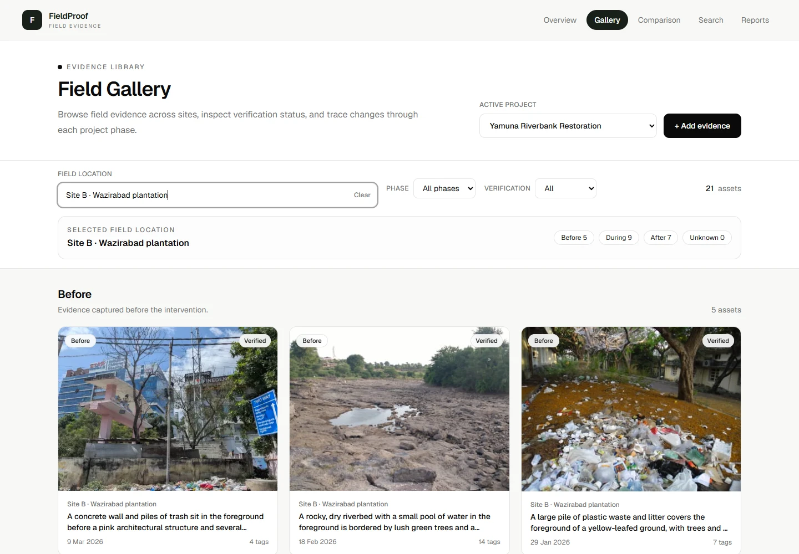
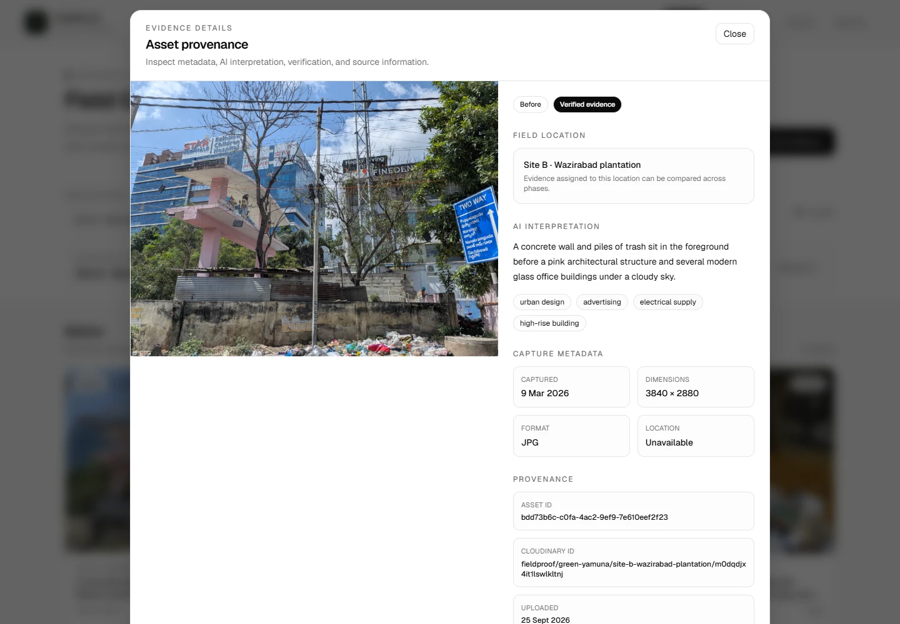
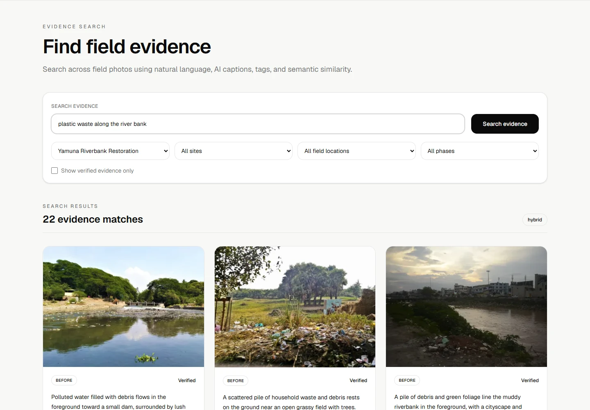
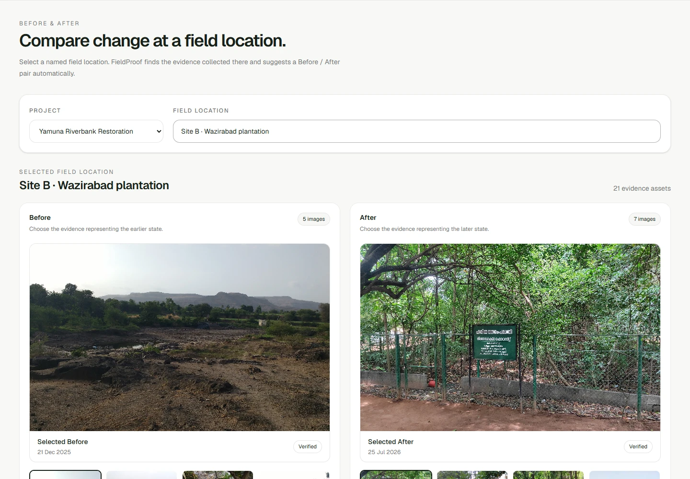
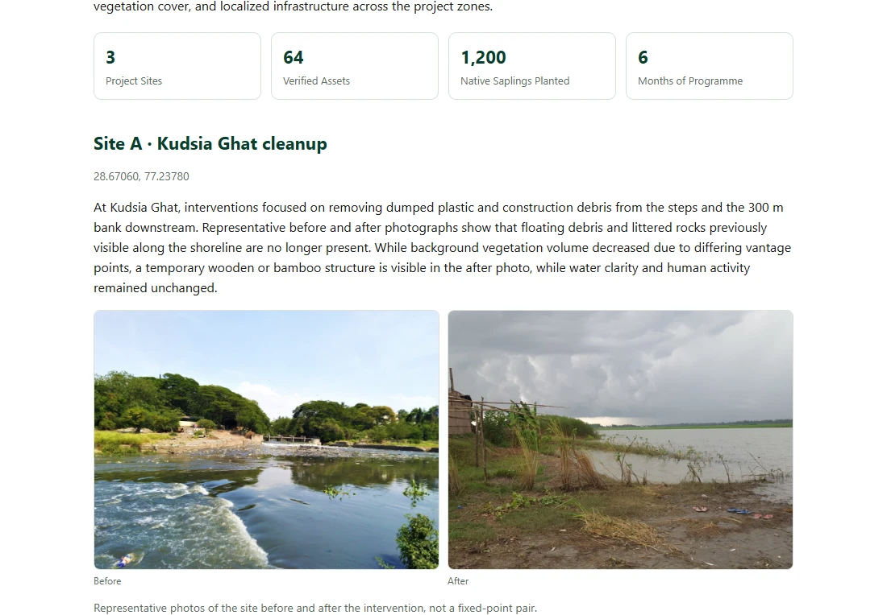
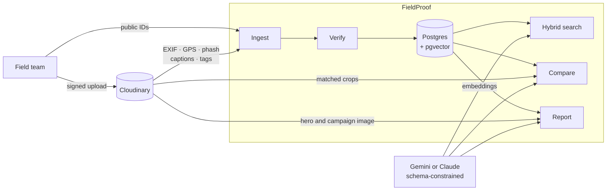

<div align="center">

# FieldProof

### Field photos in. Verified, searchable, report-ready evidence out.

An impact and sustainability media platform for NGOs, built on Cloudinary.

**[Live demo](https://fieldproof-kappa.vercel.app)** &nbsp;·&nbsp; [Two-minute tour](#two-minute-tour) &nbsp;·&nbsp; [How Cloudinary is used](#how-cloudinary-is-used) &nbsp;·&nbsp; [API reference](docs/API.md)

    [](LICENSE)

<a href="https://fieldproof-kappa.vercel.app">
  
</a>

<sub>Code Cubicle 2026 · Problem Statement 02</sub>

</div>

## The problem

An NGO restoring a riverbank takes thousands of photos over six months. They end up in phone galleries and chat groups: no site, no date anyone trusts, duplicates everywhere.

Then a donor asks a simple question: **what changed?** Answering it takes weeks of sorting by hand. And when the report is finally written, nobody can say where a given image came from, or whether it shows what the caption claims.

## What FieldProof does

| | What you get | How it works |
|---|---|---|
| **Organises** | Every photo lands in the right site and phase | Site from GPS distance, phase (before, during, after) from the EXIF capture date |
| **Verifies** | Doubtful photos are flagged and kept out of reports | Near-duplicate detection by perceptual hash, GPS and date sanity checks, phase-order conflicts |
| **Compares** | A before and after pair becomes a plain-language assessment | A vision model rates five fixed metrics and says honestly whether the two photos show the same spot |
| **Searches** | "plastic waste along the river bank" finds the photos | Semantic and keyword search fused, with keyword fallback if the AI provider is down |
| **Reports** | One click produces a donor-ready impact report | The narrative is written only from recorded facts, and every image traces back to its original |

## Two-minute tour

Open the **[live demo](https://fieldproof-kappa.vercel.app)** and choose *Yamuna Riverbank Restoration*. The header links every section.

| Step | Where | What to look for |
|---|---|---|
| 1 | **Overview** | 64 photos across 3 sites, sorted into phases without anyone tagging them |
| 2 | **Gallery** → pick a field location → open a photo | The provenance panel: capture metadata, AI caption and tags, and the Cloudinary asset it came from |
| 3 | **Comparison** → *Site B · Wazirabad plantation* → a saved assessment | Drag the slider, then read the five metrics and the "same location" verdict |
| 4 | **Search** → `plastic waste along the river bank` | Results ranked by meaning, not only by matching words |
| 5 | **Reports** → *Open report* | A self-contained page that prints to PDF |

New comparisons and reports run on the free Gemini tier and take 10 to 90 seconds. Run one at a time.

## Screenshots

<table>
  <tr>
    <td width="50%"></td>
    <td width="50%"></td>
  </tr>
  <tr>
    <td align="center"><b>Project dashboard</b><br><sub>Totals, latest evidence, field locations</sub></td>
    <td align="center"><b>Gallery</b><br><sub>One location, grouped by phase, with verification status</sub></td>
  </tr>
  <tr>
    <td></td>
    <td></td>
  </tr>
  <tr>
    <td align="center"><b>Provenance</b><br><sub>Where a photo came from and what was derived from it</sub></td>
    <td align="center"><b>Search</b><br><sub>Natural language over captions, tags and embeddings</sub></td>
  </tr>
  <tr>
    <td></td>
    <td></td>
  </tr>
  <tr>
    <td align="center"><b>Pair selection</b><br><sub>A before and after pair is suggested for each location</sub></td>
    <td align="center"><b>Impact report</b><br><sub>Narrative, key numbers and evidence in one page</sub></td>
  </tr>
</table>

## How Cloudinary is used

Cloudinary is the media pipeline, not only the storage. All of it lives in [`src/server/cloudinary.ts`](src/server/cloudinary.ts).

| FieldProof needs | Cloudinary capability | Details |
|---|---|---|
| Uploads that never pass through our server | **Signed direct uploads** | The server signs the parameters; the browser posts the file straight to Cloudinary |
| Where and when a photo was taken | **`image_metadata`** | EXIF capture date and GPS, parsed in [`exif.ts`](src/server/lib/exif.ts) and [`geo.ts`](src/server/lib/geo.ts) |
| Catching the same photo uploaded twice | **`phash`** | Perceptual hashes compared by Hamming distance in [`verify.ts`](src/server/lib/verify.ts) |
| Captions and tags for search | **AI captioning and auto-tagging add-ons** | If a free quota runs out, only the failing add-on is dropped and a vision model fills the gap |
| Before and after images that line up | **Transformations** `c_fill,g_auto` | Both photos get the same 1024 × 768 crop, so the slider compares like with like |
| Fast grids | **`f_auto,q_auto` delivery** | Pages load 400 px thumbnails; originals are only opened on request |
| A shareable campaign image | **Text overlays and gradient effects** | Headline and organisation name composed onto the hero photo by URL alone |
| Trust | **Public ID as the anchor** | Every derived URL is stored with its exact transformation in a `provenance` table |

## How it works



1. **Ingest.** For each uploaded photo: read EXIF, assign the site by GPS and the phase by date, run verification, embed the caption and tags.
2. **Verify.** A photo with a blocking flag (duplicate, future date, phase-order conflict, no site match) is marked unverified. Reports leave unverified photos out by default.
3. **Compare.** The model must answer in a fixed JSON schema, validated with Zod. It reports whether the photos show the same place. In strict mode, when they clearly do not, every metric is returned as "not visible" instead of guessed.
4. **Report.** The narrative prompt receives counts, captions and comparison results, and nothing else. It is told to use only those facts.

## Built with

| Layer | Choice |
|---|---|
| App | Next.js 16 (App Router), React 19, TypeScript in strict mode, Tailwind CSS 4 |
| Media | Cloudinary: uploads, analysis add-ons, transformations, overlays, delivery |
| Data | Postgres with pgvector through Drizzle ORM. Neon in production, embedded PGlite locally |
| AI | Gemini by default (free tier), Claude as an alternative. Gemini or Voyage embeddings |
| Quality | 55 unit and integration tests (Vitest), ESLint and a strict type check |

Everything runs on free tiers. No card is needed.

## Run it locally

```bash
git clone https://github.com/yabhinav1/fieldproof.git
cd fieldproof
npm install
cp .env.example .env      # every key is optional; the app boots with none
npm run seed              # demo project and its three sites
npm run dev               # http://localhost:3000
```

With no `DATABASE_URL`, an embedded Postgres is created in `./.pglite`. Migrations run on start.

| Integration | Variable | Without it |
|---|---|---|
| Cloudinary | `CLOUDINARY_URL` | Uploads, comparisons and reports answer 503 |
| Cloudinary add-ons | `CLOUDINARY_AUTO_TAGGING`, `CLOUDINARY_CAPTIONING` | The vision model writes captions and tags instead |
| Gemini | `GEMINI_API_KEY` | No comparisons or report narratives; search is keyword-only |
| Neon Postgres | `DATABASE_URL` | Embedded PGlite is used |

<details>
<summary><b>Load the demo photos</b></summary>

```bash
npm run photos -- --curated data/curated.json    # 64 openly licensed photos from Wikimedia Commons
npm run upload -- --project green-yamuna --dir ./data
```

Folders named like a site (`site-a`) pin the site, and a `before`, `during` or `after` folder pins the phase. Otherwise GPS and EXIF decide, and anything ambiguous is flagged for review.

</details>

<details>
<summary><b>All scripts</b></summary>

| Command | What it does |
|---|---|
| `npm run dev` / `build` / `start` | Development server, production build, production server |
| `npm test` | Unit tests and integration tests against an in-memory Postgres |
| `npm run lint` / `typecheck` | ESLint and the TypeScript compiler |
| `npm run seed` | Create the demo project and sites |
| `npm run photos` | Download the demo photo set into `data/` |
| `npm run upload` | Upload a folder to Cloudinary and ingest it |
| `npm run reanalyze` | Re-run analysis on photos that are missing captions |
| `npm run cloudinary:setup` | Register named transformations and metadata fields in Cloudinary |
| `npm run db:generate` | Regenerate SQL migrations after a schema change |

</details>

<details>
<summary><b>Deploy your own</b></summary>

Import the repository into Vercel and set the variables from [`.env.example`](.env.example). Use a Neon pooled connection string for `DATABASE_URL`.

The API has no accounts. On a public deployment set `PROTECT_DEMO_DATA=true`, which refuses every delete and leaves uploads, comparisons and reports working.

</details>

<details>
<summary><b>Notes on the Gemini free tier</b></summary>

- The default model is `gemini-3.5-flash-lite`, the tier that answers reliably on a free key. When a model is busy, the backend moves down `GEMINI_FALLBACK_MODELS` and skips that model for two minutes.
- Comparisons take 10 to 30 seconds and reports 30 to 90 seconds.
- Cloudinary add-ons do not run on the `samples/` images that new accounts come with. Upload your own photos.

</details>

## Project structure

```
src/
├── app/                      Pages and API routes
│   ├── page.tsx              Project list
│   ├── project/[id]/         Project dashboard
│   ├── gallery/              Evidence library, upload and provenance
│   ├── comparison/           Before and after with AI assessment
│   ├── search/               Natural language search
│   ├── report/               Report generation and history
│   ├── credits/              Photo credits
│   └── api/                  Route handlers, one folder per resource
├── components/               Shared header, footer and UI primitives
├── lib/                      Browser helpers: API client, image URLs, location rule
└── server/
    ├── cloudinary.ts         Every Cloudinary call and transformation
    ├── ai/                   Prompts, schema-constrained generation, embeddings
    ├── services/             Ingest, search, comparisons, reports
    ├── lib/                  EXIF, GPS, phase, perceptual hash, verification
    └── db/                   Drizzle schema and database connection
tests/                        Unit tests, plus integration tests on an in-memory Postgres
drizzle/                      SQL migrations
scripts/                      Seed, photo download, bulk upload, maintenance
docs/                         API reference and screenshots
```

Full endpoint documentation is in **[docs/API.md](docs/API.md)**.

## Team

| Member | | Focus |
|---|---|---|
| Abhinav | [@yabhinav1](https://github.com/yabhinav1) | Backend, Cloudinary pipeline, AI and search |
| Aniket Tiwari | [@tiwarianikettt](https://github.com/tiwarianikettt) | Frontend and user experience |
| Jatin Rohilla | [@ByteJatin](https://github.com/ByteJatin) | Design and testing |

## Credits and licence

The code is released under the [MIT Licence](LICENSE).

The demo photographs, including those in the screenshots above, are from Wikimedia Commons under Creative Commons and public-domain licences. Authors and licences are listed in **[data/ATTRIBUTION.md](data/ATTRIBUTION.md)** and on the app's [photo credits page](https://fieldproof-kappa.vercel.app/credits). The demo project, its sites and its dates are illustrative; the people and places shown have no connection to FieldProof.
